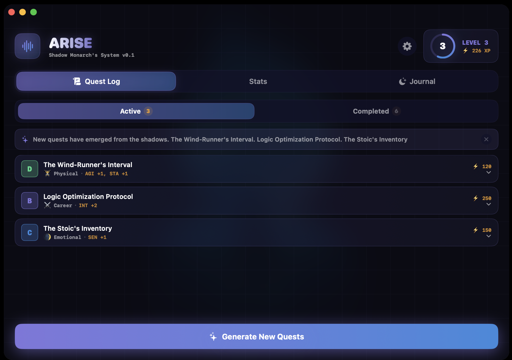
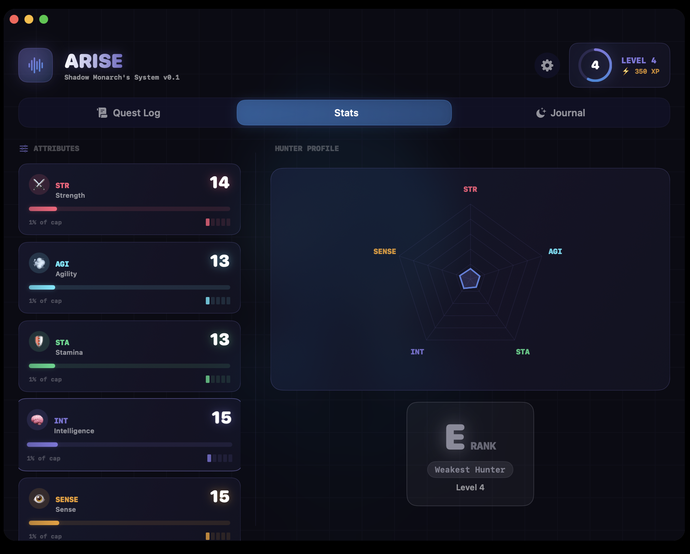

<div align="center">
  
   <br/>
   <h1>ARISE — Shadow System</h1>
   <strong>A native macOS AI Assistant inspired by Solo Leveling.</strong>
</div>

## 🌌 Overview

**ARISE** is a gamified, autonomous macOS AI system designed to structure your daily life. Acting as a persistent "System", it tracks your stats, issues daily quests across multiple domains (Career, Physical, Emotional), analyses your shadow journal, and offers a beautiful, frictionless voice HUD powered by Google Gemini.

Designed for peak productivity and gamification, ARISE helps you level up in real life. 

<br/><br/>

&nbsp;&nbsp;

---

## ✨ Core Features

### 🎙️ The Voice HUD
- Activable anytime via **`⌥ + Space`**.
- Powered by `gemini-2.0-flash` for high-speed, sub-second reasoning.
- Real-time sentence-by-sentence TTS (Text-to-Speech) using Apple's premium `AVSpeechSynthesizer`.
- Glassmorphic floating pill design that sits unobtrusively on your screen.

### ⚔️ Active Quest Engine
- Procedurally generated, stat-tailored quests.
- **Domains:** Career (INT), Physical (STR/STA), Emotional (SENSE).
- Track streaks, miss penalties, and dynamic leveling.

### 📚 Learning Dungeons
- Give the system a research topic. 
- ARISE will run a live web search to build a deep structural summary.
- The system tests your mastery via dynamically generated quizzes.

### 🌑 Shadow Journal
- Let out your frustrations. The system analyzes your emotional state.
- Stores historical journals, identifies `Mood/Intensity`, and triggers proactive systemic responses built on empathetic prompts.



<br/><br/>

---

## 🛠️ Architecture & Tech Stack

| Layer | Technology | Purpose |
| --- | --- | --- |
| **Language** | `Swift 5.9 / macOS 13+` | Native performance and system integration. |
| **UI Framework** | `SwiftUI` | Translucent HUDs, visual effects, reactive data binding. |
| **Database** | `SQLite 3` via `GRDB.swift`| Local-first persistence. Strict, schema-based state management. |
| **AI LLM** | `Google Gemini API`| Reasoning, JSON enforcement, web-search grounding. |
| **Audio** | `AVFoundation` | Voice capture (Whisper STT mock structure) & synthesized TTS. |

---

## 🚀 Getting Started

### Prerequisites
- macOS 13.0 (Ventura) or later.
- Swift Package Manager (`swift build`).
- Ensure you have a Google Gemini API Key. (You can save it in the App Settings safely into macOS Keychain).

### Running Locally

```bash
# Clone the repository
$ git clone https://github.com/your-username/ARISE.git
$ cd ARISE

# Build and execute the system silently
$ swift run ARISE > /dev/null 2>&1 &
```

> **Note**: ARISE operates as a menu-bar agent. You will not see a bouncing dock icon. Look for the `⌇` (waveform) icon in your top-right menu bar.

### Resetting & New Users
1. Open the **Dashboard** via the menu bar icon.
2. Click the **Settings Gear** (`⚙️`) in the top right.
3. Under *Data Operations*, click **System Reawakening (Factory Reset)**. This will securely wipe your SQLite store and prompt the new-user Onboarding flow.

---

## 📝 Configuration & Settings

The `SettingsView` gives you absolute control over the system:
- **Keys:** Link your personal Gemini API key.
- **Voice Output:** Mute or unmute TTS responses globally.
- **Data Extractor:** Export your entire unencrypted journal and quest history purely as JSON format for personal backups.

---
*“Do you accept this quest, Hunter?”*
